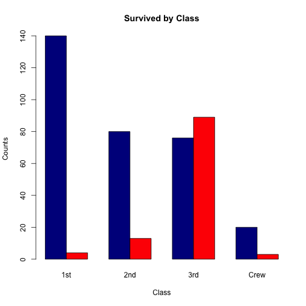

Titanic dashboard R Shiny application
========================================================
author: Corentin Isma Gaël
date: 28/11
autosize: true

Useful links
========================================================

- [Shiny app deployed](https://corentincoste.shinyapps.io/ing5-dataanalytics-shinyapp/)
- [R Presentation]()
- [GitHub of the project](https://github.com/CorentinCOSTE/ING5-DataAnalytics-ShinyApp)

Titanic dataset
========================================================

|     | Male| Female|
|:----|----:|------:|
|1st  |   57|    140|
|2nd  |   14|     80|
|3rd  |   75|     76|
|Crew |  192|     20|

|     | Male| Female|
|:----|----:|------:|
|1st  |    5|      1|
|2nd  |   11|     13|
|3rd  |   13|     14|
|Crew |    0|      0|

***

|     | Male| Female|
|:----|----:|------:|
|1st  |  118|      4|
|2nd  |  154|     13|
|3rd  |  387|     89|
|Crew |  670|      3|

|     | Male| Female|
|:----|----:|------:|
|1st  |    0|      0|
|2nd  |    0|      0|
|3rd  |   35|     17|
|Crew |    0|      0|

User inputs for the dashboard
========================================================

One can choose a set of values for these field, and compare it to another set of values

- **Survived**
- **Age**
- **Sex**

Example : *Yes/Adult/Female* v.s. *No/Adult/Female*

Example of plot
========================================================
left:30%
**Blue bars:** How many female adults survived the Titanic

**Red bars:** How many female adults did not survive the Titanic

***

Explaination of the example
========================================================
left:30%
We can observe that a woman chance of surviving increases as her class increases.

***

